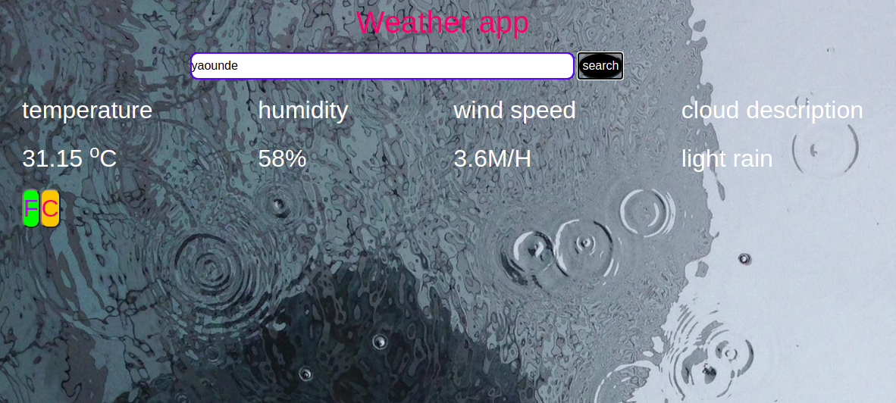

# WeatherApp
This projects Aims at introducing learners on how to work with API'S and Asynchronous functions in javascript
 

## Built With

- HTML & CSS
- BOOTSTRAP FRAMEWORK
- Javasript

## Getting started
   To get a local copy up and running follow these simple example steps.
# Setup
- Clone the project locally.
- Run `npm install` followed by  `yarn install` to download all dependencies for the WeatherApp list project.
- Type the command `cd WeatherApp`
- -Run `npx webpack --watch` to compile all the Js code.
- Use any browser of your choice to open the index.html file (double click on it and options appear then you chose)

## Live Demo

- [Live Demo Link](https://che30.github.io/WeatherApp/)
 

## Author
**Che Blanchard**
- GitHub: [@che30](https://github.com/che30)
- LinkedIn: [Che Blanchard](https://www.linkedin.com/in/che-nsoh-9455271b0/)
- Twitter: [@che55085128](https://twitter.com/che55085128)

## Acknowledgements
- The next web
- W3 schools
- Font awesome
- Stack overflow

##  Contributing

Contributions, issues, and feature requests are welcome!

## Show your support

Give a ⭐️ if you like this project!